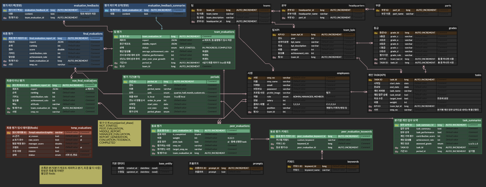

# 🌟 Skoro-Backend Refactoring
이 레포지토리는 기존 Skoro-Backend의 코드 품질, 유지보수성, 성능 및 확장성을 대폭 향상시키기 위한 리팩토링을 목표로 합니다. 

## 🛠️ 규칙
리팩토링 과정에서 다음과 같은 규칙들을 준수합니다.
- 기존 기능 유지: 리팩토링 후에도 기존 기능이 정상적으로 작동해야 합니다.
- 코드 가독성: 명확하고 이해하기 쉬운 코드를 작성합니다.
- 테스트: 변경되는 코드 및 새로운 기능에 대한 충분한 테스트를 작성하여 안정성을 확보합니다.
- 일관성: 프로젝트 전반에 걸쳐 코딩 스타일 및 네이밍 규칙을 일관되게 적용합니다.
- 커밋 메시지: 명확하고 이해하기 쉬운 커밋 메시지를 작성하며, 한 번에 하나의 기능만 커밋합니다.

## ✅ 개선 사항
- Entity 명 변경
  - FinalEvaluationReport -> FinalEvaluation
  - FeedbackReport -> NonFinalEvaluation
- 불필요한 연관 관계 제거
  - EvaluationFeedback, EvaluationFeedbackSummary에서 periodId 제거
  
## 🗄️ ERD

